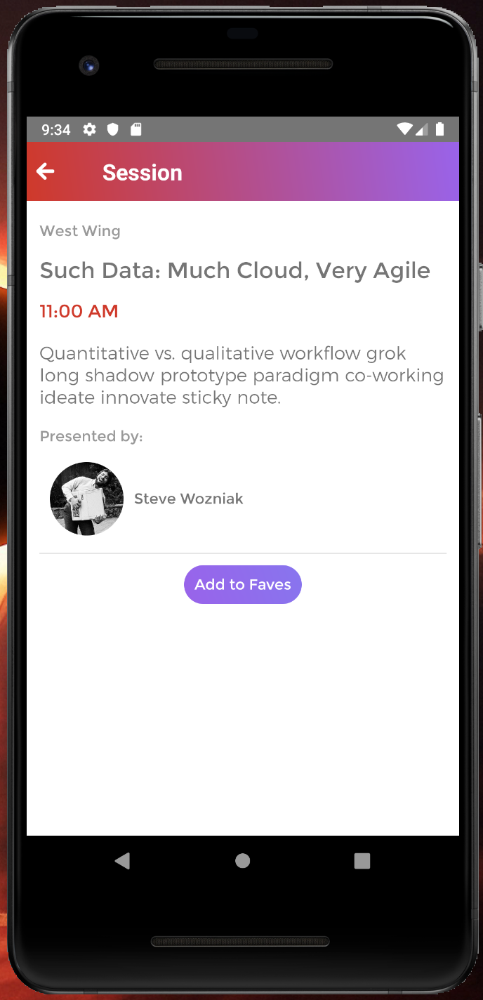

# R10 project

## Description

R10 is a cross platform(Android and IOS) mobile application built using react native. Its about a made up upcoming developer conference where the user can see the schedule for the individual sessions within the conference along with information regarding those sessions such as their locations, the topic they will cover and the speaker for the session.

## Screenshots

Below are the screenshots taken from IOS simulator.

### Schedule Screen


### Session Screen



## Installation

- Make sure to have Node and Homebrew Installed.
- Run the command 'brew install watchman' in your terminal.
- Run the command 'npm install -g react-native-cli' in your terminal.
- Clone repo or download as a zip file.
- Run yarn in root directory.
- To run the app on a emulator/simulator run the following commands in the root directory.

### IOS Simulator

```bash
react-native run-ios
```

### Android Emulator

```bash
react-native run-android
```

## Technologies Used

- React Native
- Async Storage
- GraphQL
- Google Maps API

## Author

Emre Kaynak (LinkedIn: www.linkedin.com/in/emre-kaynak-1381a6168)

## Personal Experience

This was my first time using react native to build a mobile application. Utilizing the knowledge that I have of react and javascript, I have manage to build an application that can run on both IOS and Android devices. I can see how using a framework, where most of the code is shared and I do not have to do a lot of environment specific coding can be useful to build a cross platform application such as R10.
